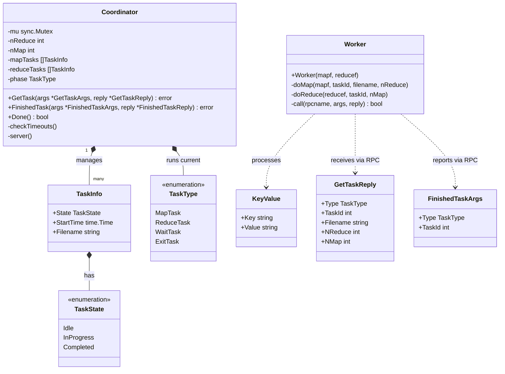

Process 和 Thread

协程（Goroutine）和 线程（Thread）有什么区别？Goroutine 是 Go 语言运行时（Runtime）在用户态调度的。

---

# MapReduce Lab 1 Architecture & Class Diagram

The following diagram illustrates the structures, enumerations, methods, and relationships of the `Coordinator` and `Worker` implementation we wrote for Lab 1.

## Class Diagram (Mermaid)



---

## System Flow & File Interaction

```
           +--------------------------------------------+
           |                Coordinator                 |
           |  (Tracks map/reduce tasks & enforces 10s)  |
           +--------------------------------------------+
                 ^                                ^
    1. GetTask   |                                |  3. FinishedTask
       RPC       |                                |     RPC
                 v                                v
    +---------------------------------------------------+
    |                      Worker                       |
    +---------------------------------------------------+
        |                                           |
        | 2a. Run Map Phase                         | 2b. Run Reduce Phase
        v                                           v
 [Input: pg-*.txt]                           [Intermediate: mr-X-Y]
        |                                           |
        | (JSON Encode)                             | (JSON Decode)
        v                                           v
 [Temp Files: mr-tmp-*]                      [Temp Files: mr-out-tmp-*]
        |                                           |
        | (Atomic Rename)                           | (Atomic Rename)
        v                                           v
[Intermediate: mr-X-Y]                       [Final Output: mr-out-Y]
```

### Explanations of Components:
1. **Coordinator Struct:** Acts as the passive master. It keeps a record of all Map and Reduce tasks using slices of `TaskInfo`. It handles concurrency safely by guarding updates with a `sync.Mutex`.
2. **TaskInfo Struct:** Tracks the lifetime of a task—whether it is `Idle`, `InProgress`, or `Completed`—and logs `StartTime` to re-assign tasks if a worker crashes or takes longer than 10 seconds.
3. **TaskType & TaskState Enums:** Decouples task stages (`MapTask`, `ReduceTask`, `WaitTask`, `ExitTask`) and state progress (`Idle`, `InProgress`, `Completed`).
4. **Worker Functions:** Runs in a loop, fetching tasks from the Coordinator.
   * `doMap` processes input text, maps them to `KeyValue` slices, partitions them using `ihash(key) % nReduce`, encodes them into JSON temporary files, and atomically renames them to prevent corruptions.
   * `doReduce` decodes partitions from intermediate files, sorts them, calls `reducef`, writes to a temporary output file, and atomically renames it to `mr-out-ReduceID`.
